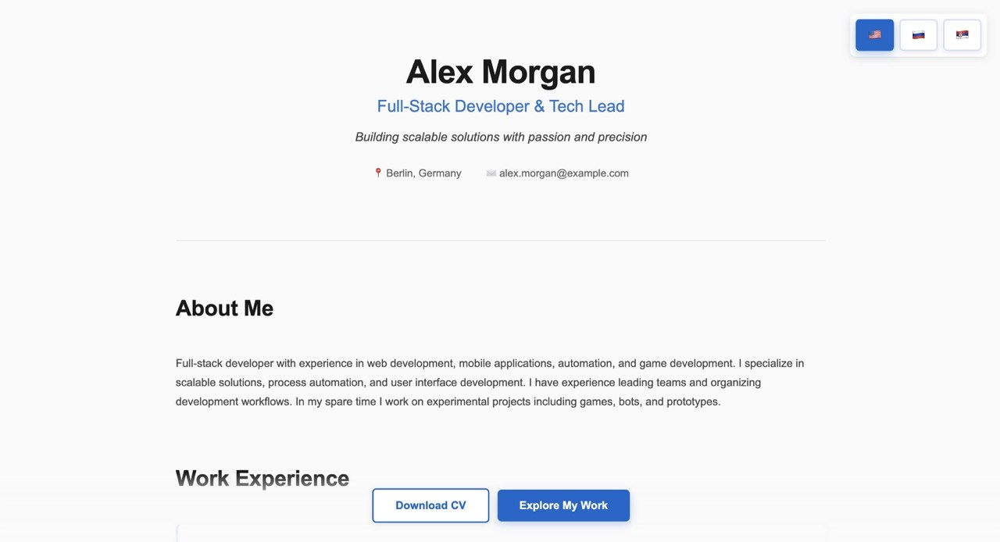
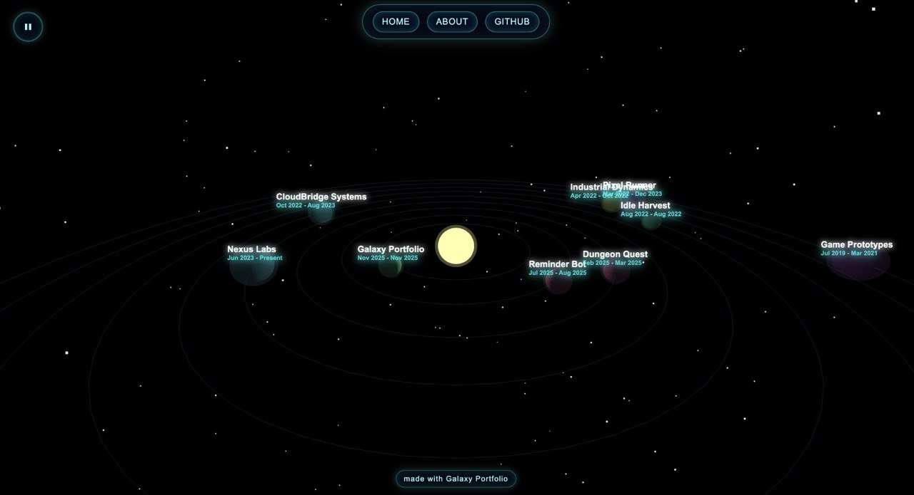

# Galaxy Portfolio

[](LICENSE)
[](https://wantid.github.io/galaxy-portfolio/)
[](https://threejs.org/)
[](https://vitejs.dev/)

**3D portfolio / resume constructor** built with Three.js — inspired by Metroid Prime.

<p align="center">
  <a href="https://wantid.github.io/galaxy-portfolio/">
    
  </a>
</p>

<p align="center">
  <a href="https://wantid.github.io/galaxy-portfolio/"><strong>🌐 Live Demo</strong></a>
  &nbsp;·&nbsp;
  <a href="docs/CUSTOMIZATION.md"><strong>Customization Guide</strong></a>
  &nbsp;·&nbsp;
  <a href="CONTRIBUTING.md"><strong>Contributing</strong></a>
</p>

## Features

- **3D galaxy** — each project or job is a planet orbiting the sun; click to open Markdown details
- **JSON-driven** — edit `data/welcome.json`, `data/planets.json`, and `content/` — no code changes needed
- **Welcome page** — classic CV layout for recruiters; export selected sections to PDF
- **Multilingual** — add languages with flag emoji keys in `welcome.json` (demo: EN / RU / SR)
- **Zero backend** — fork, customize, push to `main` → [GitHub Actions](.github/workflows/deploy.yml) deploys to Pages
- **Deep links** — share a project: `#/planet/galaxy-portfolio`
- **Mobile-friendly** — touch planet clicks, responsive welcome page
- **WebGL fallback** — clear instructions if WebGL is unavailable

## Quick Start

**Prerequisites:** Node.js 18+

```bash
# 1. Fork this repo on GitHub

# 2. Clone and install
git clone https://github.com/YOUR_USERNAME/galaxy-portfolio.git
cd galaxy-portfolio
npm install

# 3. Customize your data
#    - data/welcome.json   → name, experience, contacts
#    - data/planets.json   → projects as planets
#    - content/            → Markdown descriptions

# 4. Run locally
npm run dev

# 5. Push to main → GitHub Pages deploys automatically
```

### Fork checklist

| File | Replace with your data |
|------|------------------------|
| [`data/welcome.json`](data/welcome.json) | Hero, work history, skills, contacts |
| [`data/planets.json`](data/planets.json) | Your projects and roles |
| [`data/tabs.json`](data/tabs.json) | GitHub link, About tabs |
| [`content/`](content/) | Markdown files and images |
| [`vite.config.js`](vite.config.js) | `base: '/your-repo-name/'` |
| [`index.html`](index.html) | OG meta URLs (optional) |

See the full guide in [`docs/CUSTOMIZATION.md`](docs/CUSTOMIZATION.md).

See [`docs/MEDIA.md`](docs/MEDIA.md) for which images and GIFs to prepare.

## Screenshots

<table>
  <tr>
    <td align="center"><strong>Welcome Page</strong><br></td>
    <td align="center"><strong>3D Universe</strong><br></td>
  </tr>
</table>

## Controls

### Welcome page

- **Language switcher** — top-right flag buttons (saved in `localStorage`)
- **Download CV** — export selected sections to PDF
- **Explore My Work** — animated transition into the 3D universe

### 3D universe

| Input | Action |
|-------|--------|
| Left mouse + drag | Orbit camera |
| Right mouse + drag | Pan camera |
| Mouse wheel | Zoom |
| Click planet / label | Open detail modal |
| ⏸ button | Pause / resume orbital motion |
| Touch (mobile) | Tap planet to open modal |

### Global tabs

Configured in `data/tabs.json`:

- **`home`** — return to welcome page
- **`modal`** — open About (or any Markdown modal)
- **`link`** — open external URL

## Project structure

```
galaxy-portfolio/
├── data/              # JSON config (edit these)
│   ├── welcome.json   # Resume / welcome page (multilingual)
│   ├── planets.json   # 3D planets (projects)
│   └── tabs.json      # Top navigation bar
├── content/           # Markdown + images
├── src/
│   ├── main.js        # App logic, welcome page, PDF export
│   ├── scene.js       # Three.js 3D scene
│   ├── modal.js       # Markdown modals
│   ├── routes.js      # Hash routes (#/planet/...)
│   └── styles.css
├── scripts/
│   └── copy-data.js   # Sync data/ and content/ for dev & build
└── docs/              # Guides, screenshots, marketing drafts
```

## Configuration

Planets, tabs, and welcome page fields are documented in **[`docs/CUSTOMIZATION.md`](docs/CUSTOMIZATION.md)**.

Quick example — add a planet in `data/planets.json`:

```json
{
  "name": "My Project",
  "startDate": "2024-01-01",
  "endDate": "2024-06-01",
  "tabs": [
    {
      "title": "Overview",
      "content": "content/my-project/description.md"
    }
  ]
}
```

Share it: `https://your-site.github.io/your-repo/#/planet/my-project`

## Development

```bash
npm install
npm run dev      # http://localhost:5173/galaxy-portfolio/
npm run build    # output in dist/
npm run preview  # preview production build
```

`npm run copy-data` copies `data/` → `src/data/` and `content/` → `public/content/`. Dev and build run this automatically.

## GitHub Pages deployment

1. Create a repository and push this project (`main` branch)
2. Set Pages source to **GitHub Actions** (Settings → Pages)
3. Every push to `main` runs [`.github/workflows/deploy.yml`](.github/workflows/deploy.yml)

If your repo name differs from `galaxy-portfolio`, update `base` in `vite.config.js`:

```js
base: '/your-repo-name/',
```

Site URL: `https://<username>.github.io/<repo>/`

Recommended GitHub Topics: see [`docs/GITHUB_TOPICS.md`](docs/GITHUB_TOPICS.md).

## WebGL troubleshooting

If the 3D universe does not load:

1. Enable hardware acceleration in browser settings
2. Check WebGL: `chrome://gpu` (Chrome) or `about:support` (Firefox)
3. Update GPU drivers
4. Try Chrome, Firefox, or Edge

Test WebGL: [get.webgl.org](https://get.webgl.org/)

## Built with Galaxy Portfolio

| Site | Author |
|------|--------|
| [Live demo](https://wantid.github.io/galaxy-portfolio/) | [wantid](https://github.com/wantid) |

*Using this template? [Open a PR](https://github.com/wantid/galaxy-portfolio/pulls) to add your site!*

## Roadmap

See [`docs/ROADMAP.md`](docs/ROADMAP.md) for planned features.

## Contributing

Contributions are welcome! Read [`CONTRIBUTING.md`](CONTRIBUTING.md) for setup and PR guidelines.

## License

[MIT](LICENSE) © Dmitriy Kurilov

---

If this template helped you, consider giving it a **⭐** on GitHub!
